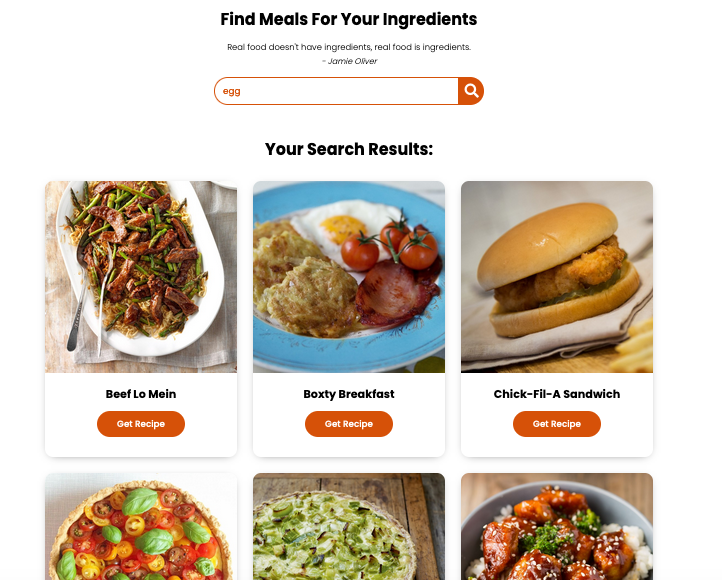

# FoodRecipeApp

To better understand and for doing more practices about API I followed tutorial on Youtube:

- [For Food Recipe App Tutorial](https://www.youtube.com/watch?v=opikz5x_1ak&t=35s)

---

[Click to see](https://ayerdelen.github.io/FoodRecipeApp/)

